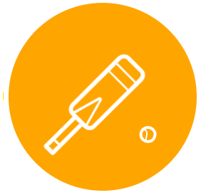
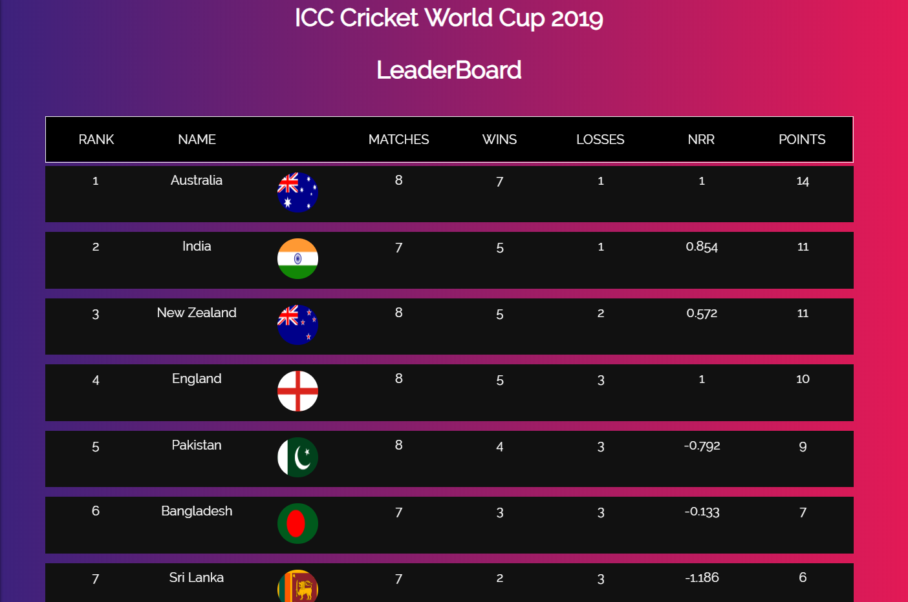
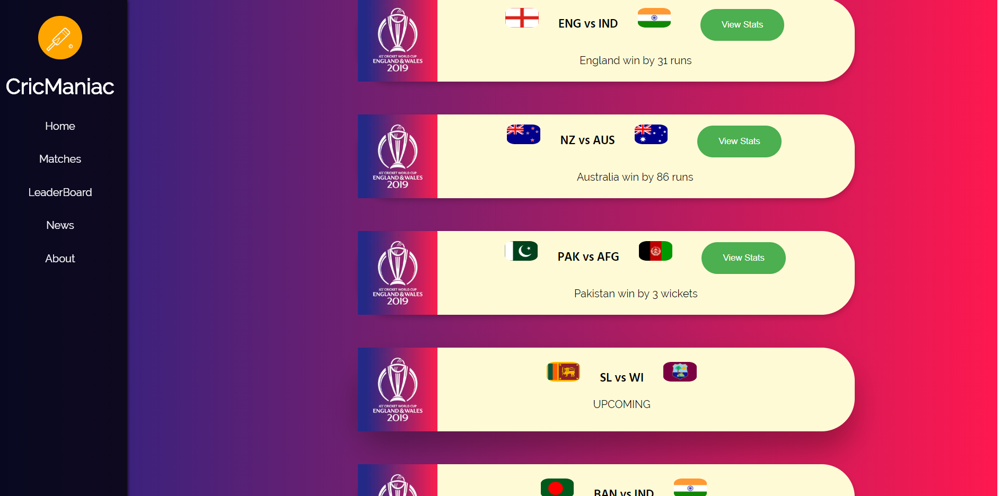
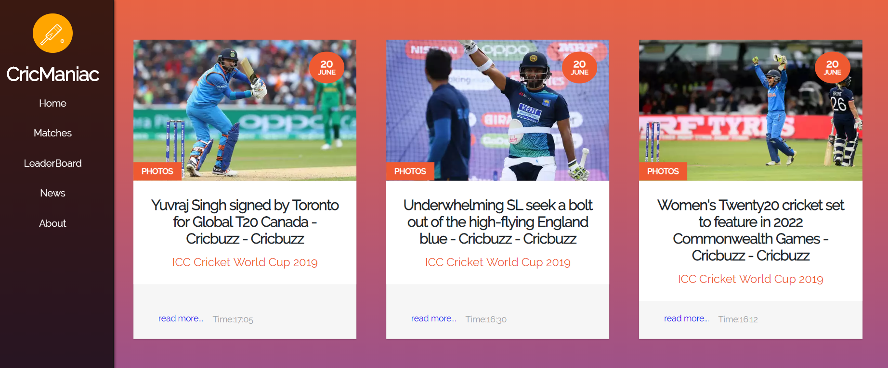
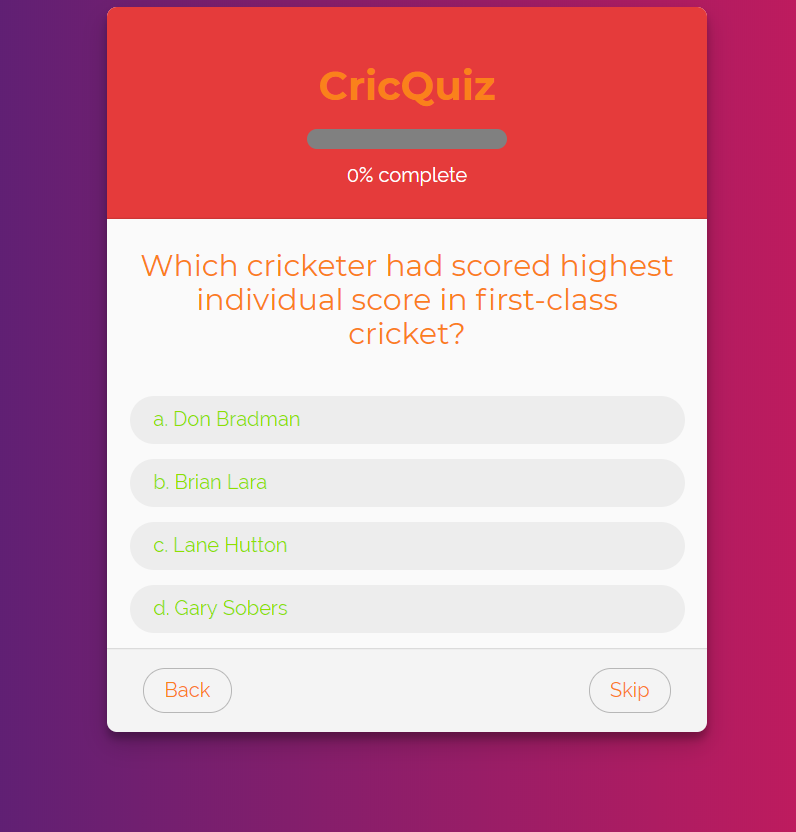

<div id="top"></div>

<!-- [![Contributors][contributors-shield]][contributors-url]
[![Forks][forks-shield]][forks-url]
[![Stargazers][stars-shield]][stars-url]
[![Issues][issues-shield]][issues-url] -->
[![MIT License][license-shield]][license-url]
<!-- [![LinkedIn][linkedin-shield]][linkedin-url] -->


<!-- PROJECT LOGO -->
<br />
<div align="center">
  <a href="https://github.com/othneildrew/Best-README-Template">
    
  </a>

  <h3 align="center">CricManiac</h3>

  <p align="center">
    An awesome web app for Cricket lovers!
    <br />
    <a href="https://github.com/huamanoid/CricManiac/blob/master/README.md"><strong>Explore the docs »</strong></a>
    <br />
    <br />
    <a href="http://cricmaniac.herokuapp.com/">View Demo</a>
    ·
    <a href="https://github.com/huamanoid/CricManiac/issues">Report Bug</a>
    ·
    <a href="https://github.com/huamanoid/CricManiac/issues">Request Feature</a>
  </p>
</div>


<!-- TABLE OF CONTENTS -->
<details>
  <summary>Table of Contents</summary>
  <ol>
    <li>
      <a href="#about-the-project">About The Project</a>
      <ul>
        <li><a href="#built-with">Built With</a></li>
      </ul>
    </li>
    <li>
      <a href="#getting-started">Getting Started</a>
      <ul>
        <li><a href="#prerequisites">Prerequisites</a></li>
        <li><a href="#installation">Installation</a></li>
      </ul>
    </li>
    <li><a href="#usage">Usage</a></li>
    <li><a href="#roadmap">Milestones</a></li>
    <li><a href="#license">License</a></li>
    <li><a href="#contact">Contact</a></li>
  </ol>
</details>


<!-- ABOUT THE PROJECT -->
## About The Project


CricManiac is a web based application built for **ICC Cricket World Cup 2019** that provides users :

* live scores
* stats of each player
* batting cards of live matches,
* bowling cards of live matches,
* leaderboard
* results
* team rankings
* upcoming matches
* quizes
* sports news
* favourite team landing page
* favourite team news
 
 in the very own theme of ICC 2019 just right at your fingertip and a page dedicated to your favourite team! and many more to come.


### Built With


* [Node.js](https://nodejs.org/)
* [HTML5](https://html.com/)
* [CSS3](https://css.com/)
* [Express](https://expressjs.com/)
* [Passport](http://www.passportjs.org/)
* [Passport-local](http://www.passportjs.org/)
* [Mongoose](http://www.passportjs.org/)
* [MethodOverride](https://www.npmjs.com/package/method-override)
* [Unirest](https://www.npmjs.com/package/unirest)
* [Request](https://jquery.com)
* [EJS](https://ejs.co/)
* [Vanilla JS](https://jquery.com)
* [CricApi](https://www.cricapi.com/)
* [NewsApi](https://newsapi.org/)
* [RapidApi](https://rapidapi.com/)
* [MongoDB Atlas](https://www.mongodb.com/atlas/database)
* [SVG](https://developer.mozilla.org/en-US/docs/Web/SVG)


<!-- GETTING STARTED -->
## Getting Started

_To get a local copy up and running follow these simple example steps._

### Prerequisites

Download node.js framework on your local machine
  ```sh
 https://nodejs.org/dist/v10.16.0/node-v10.16.0-x64.msi
  ```

### Installation

_Follow the steps for installing and setting up the app in your local machine._

1. Clone the repo
   ```sh
   git clone https://github.com/huamanoid/CricManiac.git
   ```
2. Install dependencies
   ```sh
   npm install
   ```
3. Run the app
   ```js
   node app.js
   ```
 4. Open in your preferred browswer
    ```
    localhost:8000
    ```


<!-- USAGE EXAMPLES -->
## Usage

<!-- Some of its cool features :
 -->





<!-- <p float="left">
  
  
</p> -->


_For more examples, please refer to the [Documentation](https://github.com/huamanoid/CricManiac/blob/master/UserDocumentation.pdf)_


<!-- ROADMAP -->
## Roadmap

- [x] Homepage
- [x] Upcoming Matches
- [x] Leaderboard
- [x] News
- [x] Sign Up
    - [x] Favourite
- [x] Stats
- [ ] About


<!-- LICENSE -->
## License

Distributed under the MIT License.


<!-- CONTACT -->
## Contact

*Aman Kumar* - [Huamanoid](https://github.com/huamanoid) - huamanoid@gmail.com

Project Link: [CricManiac](https://github.com/huamanoid/CricManiac)


<p align="right">(<a href="#top">back to top</a>)</p>


<!-- MARKDOWN LINKS & IMAGES -->
<!-- https://www.markdownguide.org/basic-syntax/#reference-style-links -->
[contributors-shield]: https://img.shields.io/github/contributors/othneildrew/Best-README-Template.svg?style=for-the-badge
[contributors-url]: https://github.com/othneildrew/Best-README-Template/graphs/contributors
[forks-shield]: https://img.shields.io/github/forks/othneildrew/Best-README-Template.svg?style=for-the-badge
[forks-url]: https://github.com/othneildrew/Best-README-Template/network/members
[stars-shield]: https://img.shields.io/github/stars/othneildrew/Best-README-Template.svg?style=for-the-badge
[stars-url]: https://github.com/othneildrew/Best-README-Template/stargazers
[issues-shield]: https://img.shields.io/github/issues/othneildrew/Best-README-Template.svg?style=for-the-badge
[issues-url]: https://github.com/othneildrew/Best-README-Template/issues
[license-shield]: https://img.shields.io/github/license/othneildrew/Best-README-Template.svg?style=for-the-badge
[license-url]: https://github.com/othneildrew/Best-README-Template/blob/master/LICENSE.txt
[linkedin-shield]: https://img.shields.io/badge/-LinkedIn-black.svg?style=for-the-badge&logo=linkedin&colorB=555
[linkedin-url]: https://linkedin.com/in/othneildrew
[product-screenshot]: images/screenshot.png
